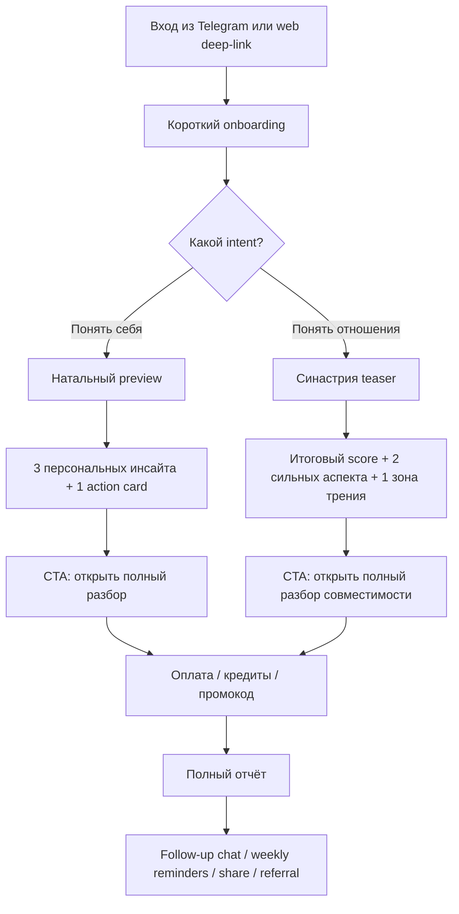
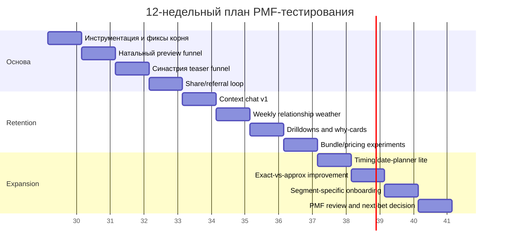
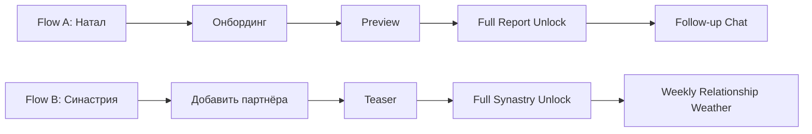

# Глубокий анализ solarsage-astro и рынка B2C-астрологии

## Executive summary

`solarsage-astro` уже выглядит не как «заготовка под астроприложение», а как довольно зрелая заготовка под **Telegram-first B2C-продукт**: в репозитории есть Telegram-аутентификация и webhook `/start`, онбординг с вводом даты/времени/места рождения, дневной астрологический экран, натальный preview и full report, синастрия, horary, election-поиск, гео-автокомплит, реферальная механика, промокоды, продуктовый каталог и биллинг через YooKassa. При этом большая часть ценности уже лежит не в UI, а в **сервисном слое и продуктовых примитивах**, которые можно быстро перепаковать в новые consumer-фичи. citeturn51view0turn49view2turn23view0turn35view0turn35view1turn17view0turn24view1turn24view2turn16view4turn25view2turn52view0

Самый сильный стратегический вывод такой: **быстрее всего PMF здесь тестируется не через “ещё один daily horoscope app”, а через связку “натал → синастрия → contextual follow-up chat → share/referral/paywall”**. Это соответствует тому, что уже реализовано в коде, и одновременно совпадает с логикой лучших consumer-продуктов рынка: Co–Star, The Pattern, CHANI, Sanctuary, Nebula, TimePassages и AstroMatrix все строят ценность вокруг персонализации, совместимости, регулярных возвратов и платного углубления, а не вокруг голой «таблицы аспектов». Это мой вывод на основе текущей архитектуры репозитория и продуктовых паттернов конкурентов. citeturn35view0turn35view1turn17view0turn53view0turn44view1turn45view0turn46view0turn43search0turn31search10turn27search1turn27search2

На рынке B2C-астрологии сейчас хорошо видны четыре устойчивых кластера. Первый — **aesthetic/social astrology** вроде Co–Star, где value строится на ежедневных пушах, social graph и relationship friction. Второй — **self-work / premium content** вроде CHANI и The Pattern, где пользователи платят за глубину, аудио, timing и библиотеку контента. Третий — **psychic marketplace** вроде Sanctuary, Nebula и AstroSage, где astrology — фронт-дор в консультации и платные минуты. Четвёртый — **tool-heavy calculators** вроде TimePassages, Astro-Seek, AstroMatrix и Cafe Astrology, где сила в точности, количестве инструментов и chart-comparison, но UX чаще перегружен. Для `solarsage-astro` наиболее выигрышная позиция — **между первым и вторым кластером**, с точечной заимствованной monetization-логикой из третьего, но без превращения продукта в «рынок гадалок» слишком рано. citeturn44view1turn45view0turn46view0turn46view3turn43search0turn43search10turn31search10turn48view0turn27search1turn32search13turn47view2

С точки зрения психологии использования, исследования показывают, что люди обращаются к таким системам прежде всего не за «объективной истинностью», а за **эмоциональной поддержкой, смысловой рамкой и навигацией в неопределённости**; при этом расплывчатые, слишком универсальные формулировки легко подпадают под Barnum effect. Для продукта это означает: выигрывает не тот, кто обещает «точные пророчества», а тот, кто даёт **понятную персональную структуру, мягкие действия и ощущение “про меня” без фальшивой детерминированности**. citeturn29search3turn29search5turn29search14

Ниже — практический вывод в одном предложении: **в ближайшие 3 месяца стоит сфокусироваться на Telegram/mobile-web воронке, где бесплатный “aha moment” — это красивый натальный preview или быстрый synastry teaser, а первая покупка — не подписка ради “всего”, а конкретный понятный unlock: full natal report, full synastry, romantic timing или personalized follow-up chat**. citeturn35view0turn17view0turn42view0turn42view1turn52view0turn44view1turn45view0turn46view3

## Краткий анализ репозитория

По README и структуре проекта это монорепозиторий с **Next.js frontend**, **FastAPI backend**, отдельным **SolarSage sidecar** для расчётов, пакетом контрактов OpenAPI/TS и production/dev-orchestration через docker-compose и скрипты. README прямо пишет, что production-path подготовлен, но запуск сейчас идёт **только вручную**; в dev-loop используются Postgres и Redis, а sidecar в production идёт как контейнер `solarsage-sidecar`. citeturn51view0

Технологический стек выглядит современно и пригодно для agent-driven разработки: на фронте используются Next.js 16, React 19, Tailwind 4, Radix UI, Recharts, Framer Motion, Zod, Playwright и Vitest; конфиг `components.json` указывает на shadcn/ui-стиль `new-york` и иконки Lucide. На бэкенде — Python 3.12, FastAPI, Pydantic 2, SQLAlchemy, Alembic, asyncpg/psycopg, httpx, anthropic, sentry-sdk; также есть строгие dev-зависимости под pytest, coverage, ruff и mypy. citeturn50view0turn50view1turn33view0

Продуктовая направленность репозитория хорошо видна уже по metadata и роутам. Root layout на фронте называет продукт **«Today — астрологический навигатор дня»**, поднимает Telegram bootstrap, correlation init, frontend error capture и Vercel analytics. Внутри route group `(grace)` есть страницы `today`, `day/[date]`, `calendar`, `checkin`, `chat`, `onboarding`, `profile`, `readings` и `synastry`, что уже задаёт consumer-скелет приложения. citeturn49view2turn40view0turn42view0turn42view1turn42view2turn42view3

Ниже — что в репозитории уже особенно ценно как **reusable product platform**.

| Область | Что уже есть | Почему это важно для PMF-тестов | Источники |
|---|---|---|---|
| Аутентификация и acquisition | Telegram login, session cookie, `/api/telegram/webhook`, канонический `/start` с WebApp-кнопкой | Можно тестировать acquisition и возвраты прямо в Telegram, без native app | citeturn16view2turn16view3turn25view4turn25view5 |
| Онбординг | Onboarding flow с предзаполнением профиля, режимом `requiredFor=promoNatal/promoBase`, поддержкой exact birth time | Можно делать сегментированные воронки для натала, промо и синастрии | citeturn42view2turn23view0 |
| Геоданные | GeoNames autocomplete и timezone endpoints | Снижает трение при вводе места рождения и пригодно для rapid UX-экспериментов | citeturn16view0turn16view1 |
| Натал | Natal preview, full report, chart/highlights/spheres/chapters, pricing hooks, “sales bullets” | Уже есть основной paid artifact для первой монетизации | citeturn35view0turn35view1turn35view2turn37view0turn37view2 |
| Синастрия | API, схемы и UI-route для партнёров, score/status/summary/aspects/spheres, approximate mode | Это лучший growth-loop для relationships и sharability | citeturn17view0turn17view2turn18view5turn42view0 |
| Ежедневный habit loop | Day screen, calendar, check-in/day feedback | Можно строить retention между большими report-покупками | citeturn42view3turn24view4 |
| Монетизация | Product catalog, subscriptions, one-time purchases, webhook billing, promo campaigns, referrals | Уже есть ценовая инфраструктура, можно тестировать CTA и упаковки, а не писать платежи с нуля | citeturn52view0turn25view2turn16view4 |
| Quota/Credits | Chat quota, horary quota/credits, synastry credit-spend | Подходит для моделирования free credits, weekly free, unlock credits | citeturn53view1turn24view1turn18view2 |

Отдельно стоит отметить сильную инженерную базу в натальном отчёте. `natal_report_service` генерирует секции по частям, валидирует JSON-структуру ответа LLM, отбрасывает пустые блоки, проверяет допустимые block types, ловит «галлюцинированные» планеты и даже fabricated sign names вроде `Ophiuchus`. Это очень полезно для consumer-B2C: здесь уже заложен **fail-closed narrative pipeline**, а не просто «промпт → текст». citeturn36view0turn36view2turn36view4

При этом у репозитория есть и заметные разрывы, которые важно превратить в roadmap, а не игнорировать.

| Разрыв | Что видно в коде | Практическое следствие | Приоритет |
|---|---|---|---|
| Root-entry inconsistency | В `app/page.tsx.backup` и `app/(grace)/page.tsx` корень должен редиректить в продуктовый флоу, но текущий `app/page.tsx` открыт как placeholder `v0 app` | Риск сломанного first impression и потери трафика на корневом URL | Очень высокий |
| Синастрия не до конца провязана в monetization/app mount | У синастрии есть отдельные API/schema/UI, но `main.py` её не импортирует, а billing-комментарий говорит `synastry stays fail-closed (not sellable)` | Готовый high-conversion use case пока не доведён до коммерческой поверхности | Очень высокий |
| Chat пока MVP | В `chat.py` прямо указано: no LLM integration, echo bot; при этом thread/quota уже есть | Отличный кандидат на быстрое улучшение perceived value | Высокий |
| Production-операции ручные | README пишет, что production path manual-only; disabled `make deploy/backup/logs/solarsage` | Быстрые продуктовые эксперименты возможны, но операционно могут замедляться | Средний |
| Payments локально ориентированы | Биллинг собран вокруг YooKassa | Нормально для RU/Telegram-first тестов, но ограничивает web/global scaling | Средний |
| Архитектура фронта переходит из legacy в canonical | Есть route group `(grace)` и отдельный `apps/web` только с Dockerfile/nginx | Нужно убрать архитектурную двусмысленность перед быстрым масштабированием UI | Средний |

Подводя итог по репозиторию: **самое ценное здесь не “готовый продукт”, а “готовая продуктовая платформа”**. Для PMF-тестирования это даже лучше: у вас уже есть identity, onboarding, astro-data plumbing, narrative engine, paywall hooks, referrals, promo и Telegram distribution. Значит, следующие 90 дней должны идти не в “строим всё заново”, а в **пересборку существующих модулей в более жёсткую воронку consumer-value**. citeturn51view0turn35view0turn17view0turn25view4turn16view4turn52view0turn53view0

## Конкурентный ландшафт

Если смотреть только на заметные consumer-продукты, рынок уже очень насыщен. Но насыщен он не одинаково: глубже всего конкуренция в generic daily horoscopes, а вот **комбинация “relationship utility + clear upgrade path + emotionally supportive explanation layer”** всё ещё даёт пространство для атаки. Это вывод из сравнительного чтения официальных сайтов, App Store/Google Play карточек и help-страниц продуктов ниже. citeturn44view1turn45view0turn46view0turn43search0turn27search1turn47view2

| Продукт | Что они продают пользователю | Топ-фичи | Монетизация | UX-паттерны | Что копировать | Что избегать | Источники |
|---|---|---|---|---|---|---|---|
| **Co–Star** | Social astrology с резким тоном | daily horoscope, compatibility с друзьями, push, paid Q&A “Ask the stars”, Eros для пары | freemium + in-app purchases и monthly plan | dark aesthetic, sharp copy, social graph, friction-as-engagement | social compatibility, короткий tone, ежедневные пуши | слишком холодный/колючий tone и резкое ощущение paywall | citeturn44view1turn44view2turn44view0 |
| **The Pattern** | Self-knowledge + relationship intelligence | natal pattern, Bonds, timing, content library, audio, time travel, dating Connect | Go Deeper+ от $14.99/мес, дополнительные слоты/Connect upsells | long-form emotional copy, deep onboarding, layered premium | time-travel/timing, Bonds, content depth | расползание продукта в “всё обо всём” до потери фокуса | citeturn45view0turn45view1turn45view3turn45view5 |
| **CHANI** | Premium astrology for reflection and healing | birth chart, weekly personalized readings, transits, meditations, affirmations, live journal | $11.99/мес или $107.99/год | calm editorial design, high trust, human voice | trust-first copy, reflective prompts, weekly cadence | слишком высокая стоимость до доказанного wow-момента | citeturn46view0turn46view1turn46view2turn46view3turn46view4 |
| **Nebula** | Astrology как вход в psychic/advisor funnel | birth chart, compatibility, daily horoscope, astrology chat, psychic readings | weekly/monthly/3-month plans, credits/offers, paid questions | offer-heavy funnel, first-time freebies, consultation upsell | first paid step через кредиты/low-ticket | агрессивные триалы и слишком “salesy” опыт | citeturn31search10turn31search7turn31search12turn31search18 |
| **Sanctuary** | Free astrology + live readers | interactive birth chart, compatibility, free horoscope/tarot/moon cycles, live astrologers/psychics | subscription + paid readings, intro offers | clean app shell + marketplace layer | hybrid free utility + expert upsell | слишком ранний marketplace до product-value | citeturn43search0turn43search3turn43search4turn43search10turn43search18 |
| **TimePassages** | Serious astrology tool for self/relationship timing | full birth chart, transits, progressions, synastry, composite, solar return | subscription, per-chart unlocks, desktop add-ons | data-dense expert UI | trust from technical depth, compatibility meter, forecasting | перегрузка терминологией и expert-first UX | citeturn27search1turn27search5turn27search9turn27search13turn43search1turn43search11turn43search17 |
| **AstroMatrix** | Broad all-in-one astrology/tarot engine | natal, synastry, transits, progressed chart, PDF export, matrix synthesis | subscriptions, lifetime licenses, ad removal/premium | feature-rich but still consumer-ish | synthesis layer вместо списка аспектов, PDF export | feature sprawl и product complexity | citeturn27search2turn47view1turn47view2 |
| **AstroSage** | Mass-market Vedic super-app + paid consultations | AI Kundli, AI horoscope, matching, calendars, PDF, live astrologers/AI astrologers | free core + chat/call rates + wallet/recharge | super-app depth, value for Indian audience | massive breadth как inspiration для future catalog | путаное pricing/баланс/тарифы и support pain | citeturn48view0turn48view1turn48view2turn48view3 |
| **Cafe Astrology** | Content + calculators + cheap reports | free natal/compatibility reports, transits, paid low-cost email reports | low-priced reports, no obvious subscription-first model | content-heavy site, utility-first | low-friction one-off report sales | устаревший UX и ручная доставка отчётов | citeturn28search4turn28search8turn32search0turn32search3turn32search14turn32search18 |
| **Astro-Seek** | Free calculators and advanced astro tools | natal, synastry, composite, traditional/sidereal tools, account/private astro DB | в официальных страницах доминирует free-account utility; явная подписка на основных страницах не акцентирована | calculator-first, high utility, low ornament | ultra-fast utility and comparison tools | too much tool surface for mainstream B2C onboarding | citeturn28search5turn28search13turn32search13turn32search16turn32search22 |

Из этой таблицы видно несколько системных правил. **Во-первых, “совместимость” — одна из самых сильных consumer-осей на всём рынке**: Co–Star, The Pattern, Sanctuary, AstroMatrix, TimePassages, Cafe Astrology и Astro-Seek все по-разному делают compatibility/synastry/composite. Это означает, что синастрия — не peripheral feature, а один из самых коротких путей к shareability, retention и оплате. citeturn44view1turn45view0turn43search0turn43search1turn47view2turn32search14turn32search16

**Во-вторых, лучшая платёжная логика в этой категории почти всегда идёт после бесплатного персонального “aha moment”**. CHANI продаёт подписку после ощущения глубины и доверия; The Pattern — после бесплатных daily updates/Bonds; TimePassages — после бесплатного chart entry point; Cafe Astrology и AstroMatrix хорошо показывают value конкретного артефакта до апгрейда. Для `solarsage-astro` это означает, что paywall надо ставить **после одного-двух сильных персональных инсайтов**, а не на первом экране. Это тоже мой вывод-обобщение из их официальных витрин. citeturn46view0turn46view3turn45view0turn27search5turn47view2turn32search18

**В-третьих, есть ясный anti-pattern:** когда astrology-продукт слишком быстро превращается в консультационный marketplace или в offer-heavy wallet funnel, пользователь начинает ощущать не “меня поняли”, а “меня монетизируют”. У AstroSage на официальной Google Play-странице видны жалобы на смену тарифа и minimum balance, а Nebula и Sanctuary строят сильный слой upsell-офферов уже на входе. Это не значит, что credits и experts не нужны; это значит, что до PMF они должны быть **вторым этажом**, а не фасадом. citeturn48view3turn31search10turn43search10

## Персоны и ключевые пользовательские сценарии

Академические и прикладные данные здесь говорят одно и то же: люди приходят в астрологические продукты прежде всего в моменты **неопределённости, отношений, эмоциональной перегрузки и поиска самообъяснения**, а не для того, чтобы читать эфемериды. Исследование по LLM-fortunetelling описывает практику обращения за эмоциональной поддержкой и смысловой рамкой; обзор роста интереса к астрологии связывает использование с психологическими факторами, самоконцепцией и coping under uncertainty; классическая работа о cold reading напоминает, что слишком общие формулировки кажутся «личными» даже когда они поверхностны. Для продукта это означает: **главная задача — быстро дать ощущение персональной полезности, но не скатиться в vague mysticism**. citeturn29search3turn29search5turn29search14

Практически я бы работал с четырьмя приоритетными B2C-персонами.

| Персона | Что хочет получить | Что её триггерит | Главные боли | Лучшая первая monetization-точка |
|---|---|---|---|---|
| **Ищущая себя** 22–34 | Понять “кто я и почему так повторяется” | кризис, переоценка, смена работы/отношений | generic copy, непонятные термины, paywall до пользы | full natal report |
| **Проверяющая отношения** 23–38 | Понять динамику пары, tension points и timing | новый роман, конфликт, “стоит ли продолжать” | нет точного времени у партнёра, стыд за “оценку отношений”, слишком жёсткий verdict | full synastry / romantic timing |
| **Ритуальный daily-user** 20–40 | Короткий ежедневный guidance ritual | утро, уведомление, возвращение в Telegram | повторяемость, недостаток actionability | subscription на weekly/deeper guidance |
| **Скептик-исследователь** 18–30 | Быстрый wow-effect и shareable result | социальный контекст, подруга/партнёр прислал ссылку | долгое заполнение, низкая доверительность, cringe copy | one-off unlock / trial credits |

Ниже — целевой пользовательский флоу, который лучше всего совпадает с уже существующими примитивами в репозитории и с рынком. Он не описывает текущий UI один в один; это **целевой product flow**, основанный на вашем коде и рыночных паттернах. citeturn42view2turn35view0turn17view0turn44view1turn45view0turn46view0

Для **натального сценария** я рекомендую основной user journey строить так:

| Шаг | Что видит пользователь | Где сейчас есть база в репо | Главная боль | Что должно происходить |
|---|---|---|---|---|
| Вход | Telegram `/start` или deep-link | Telegram webhook, route structure | пользователь ещё не верит, что стоит тратить время | обещание конкретной пользы за 60–90 секунд |
| Онбординг | дата, время, место, пол/имя | onboarding + profile + geo endpoints | тревога из-за точного времени рождения | дать exact/approximate path, объяснить зачем это нужно |
| Aha moment | 3 highlights + chart + 2–3 life spheres | natal preview schemas/service | слишком длинный текст убивает первый wow | показать не всё, а самое персональное |
| Monetization | CTA на full natal report | full_report_purchasable / price hooks / YooKassa | paywall до доверия | дать предпросмотр содержания полного отчёта |
| Retention | follow-up questions, weekly recap | chat threads/quota, day screen/checkin | после покупки нечего делать | привести в ежедневный/еженедельный ритуал |

Для **синастрии** journey должен быть ещё короче, потому что intent у пользователя горячее и более transactional.

| Шаг | Что видит пользователь | Где сейчас есть база в репо | Главная боль | Что должно происходить |
|---|---|---|---|---|
| Инициатор | “Проверим совместимость?” | synastry route/API | пользователь не знает точное время партнёра | разрешить approximate mode явно и без shame |
| Ввод партнёра | имя, relation type, дата, место, время/точность | `PartnerCreate`, geo/timezone, dedup | форма слишком длинная | progressive disclosure |
| Teaser | общий score, tone, summary, 2 аспекта, 2 сферических score | synastry report schema/service | verdict может звучать слишком жёстко | soft framing: не приговор, а карта динамики |
| Unlock | полный synastry report / timing / drilldowns | credit infrastructure + billing primitives | непонятно, за что именно платишь | paywall как “разблокировать ответы на 3 вопроса” |
| Retention | weekly relationship weather, check-ins, shared cards | day/checkin/chat/quota | после одного отчёта продукт забывается | превратить relationship insight в habit |

Это особенно важно, потому что relationship intent очень хорошо монетизируется, но очень плохо переносит токсичный UX. Если продукт скажет “у вас плохая совместимость, купите больше”, конверсия краткосрочно может вырасти, но доверие и удержание просядут. Исследование LLM-fortunetelling как раз показывает, что людям важнее поддержка и интерпретация, чем категоричная “точность”; а Co–Star, The Pattern и Sanctuary по-разному подтверждают, что relationship-space — это не только score, но и **narrative framing**. citeturn29search3turn44view1turn45view0turn43search0

## Каталог продуктовых идей

Ниже — список идей, отобранных не по «красоте», а по сочетанию **скорости сборки из существующего кода**, **вероятного влияния на engagement/monetization** и **пригодности для A/B-тестов**. Под “быстро” я понимаю то, что можно собрать преимущественно на базе уже существующих API/схем/роутов/монетизации. citeturn35view0turn17view0turn53view0turn16view4turn52view0

| Идея | Скорость | Ожидаемый impact | Что нужно по данным/алгоритмам | Что переиспользовать |
|---|---|---|---|---|
| **Натальный preview как лид-магнит** | Быстро | высокий engagement / средний revenue | уже есть preview model, нужно только sharpened UI/paywall | natal preview + onboarding + billing |
| **Full natal report unlock** | Быстро | средний engagement / высокий revenue | packaging и paywall copy | `full_report_purchasable`, product catalog, YooKassa |
| **Синастрия teaser до оплаты** | Быстро | высокий engagement / высокий revenue | score + 2 аспекта + 1 summary | synastry schemas/service/UI |
| **Approximate mode для партнёра по умолчанию** | Быстро | высокий activation / средний revenue | уже есть `birth_time_precision` | synastry `PartnerCreate` |
| **“Почему такой score?” drilldown** | Быстро | средний engagement / средний revenue | aspect drilldown cards | synastry aspect details |
| **Shareable natal card** | Быстро | высокий virality / низкий direct revenue | render-to-image / static share cards | highlights / chart / metadata |
| **Shareable synastry card** | Быстро | высокий virality / средний revenue | score + title + safe summary | synastry report summary |
| **Referral за разблокировку отчёта** | Быстро | средний engagement / высокий CAC efficiency | referral incentive tuning | referral system |
| **Smart paywall после второго инсайта** | Быстро | низкий engagement / высокий revenue uplift | event timing logic | current paywall hooks + analytics |
| **Промо-кампании “день рождения / расставание / новый роман”** | Быстро | средний engagement / средний revenue | segmentation rules | promo endpoints + onboarding modes |
| **Weekly relationship weather** | Быстро | высокий retention / средний revenue | reuse transits + partner context | day engine + synastry context |
| **Follow-up question chips** | Быстро | высокий engagement / средний revenue | deterministic question templates | natal/synastry sections + chat threads |
| **Микро-квиз после preview** | Быстро | средний engagement / средний revenue | user intent tagging | onboarding reducer + local state |
| **Reminder opt-in в Telegram** | Быстро | высокий retention / косвенный revenue | schedule/cadence testing | Telegram channel + day loop |
| **Contextual chat, grounded in natal** | Средне | высокий engagement / средний revenue | подмешивание report context в LLM prompt | chat threads/quota + natal report context |
| **Contextual chat, grounded in synastry** | Средне | высокий engagement / высокий revenue | partner/report retrieval + safer prompts | chat + synastry report |
| **Romantic timing** | Средне | высокий engagement / высокий revenue | транзиты по паре / пользователю | election/day/transit logic + synastry |
| **Partner library с тэгами и заметками** | Средне | средний engagement / низкий revenue | DB fields + list UX | synastry partners |
| **Multi-partner compare view** | Средне | высокий engagement / средний revenue | comparative scoring UI | synastry list + latest reports |
| **“Что изменится, если узнать точное время?”** | Средне | средний engagement / средний revenue | delta explanation between exact/approx | exact/approx inputs + report variants |
| **Voice summary for report** | Средне | средний engagement / средний revenue | TTS pipeline | existing report blocks |
| **Relationship check-in after 7 days** | Средне | высокий retention / низкий direct revenue | scheduled nudge + simple survey | checkin/day feedback |
| **Bundle: Natal + Synastry** | Средне | низкий engagement / высокий revenue | catalog packages | billing products + promo |
| **Date planner / election lite** | Средне | средний engagement / средний revenue | time-window ranking | election endpoints |
| **Birth-time recovery assistant** | Долго | средний engagement / высокий revenue | rectification heuristics / guided questioning | onboarding + natal context |
| **Human astrologer marketplace** | Долго | средний engagement / высокий revenue | supply ops, moderation, pricing | chat/payments but needs ops |
| **Public figure / celebrity compare** | Долго | высокий virality / средний revenue | licensed/public dataset | synastry engine + profiles DB |
| **Native mobile packaging** | Долго | средний engagement / средний revenue | app shell, notifications, store billing | frontend routes and APIs |

Из этого набора я бы отдельно выделил **пять лучших “first bets”**.

| Приоритет | Идея | Почему именно она |
|---|---|---|
| Очень высокий | Натальный preview → full unlock | уже почти готово в коде; это самый быстрый путь к первой платящей unit economics |
| Очень высокий | Синастрия teaser → full synastry | relationship intent на рынке один из самых горячих и шарится лучше всего |
| Очень высокий | Follow-up chips + contextual chat | резко поднимает perceived utility между крупными purchases |
| Высокий | Weekly relationship weather | конвертирует единичный report в повторяемый ритуал |
| Высокий | Referral/share cards | снижает CAC и ускоряет discovery без app-store scale |

Важное стратегическое замечание: **не пытайтесь сразу повторять CHANI по глубине контента или TimePassages по инструментальной плотности**. CHANI продаёт доверие и бренд-голос, TimePassages — decades-old tool ethos; это трудно догнать быстро. Зато у вас есть преимущество в скорости эксперимента и готовая Telegram-native инфраструктура. Поэтому короткий путь к PMF здесь — **не “глубже всех”, а “быстрее всех даём понятный персональный outcome”**. Это вывод из сопоставления конкурентных позиций и текущих репозиторных модулей. citeturn46view0turn46view3turn27search1turn43search1turn35view0turn17view0turn25view4

## Приоритетный роадмап на три месяца

Я предлагаю строить 12-недельный план не вокруг техдолга как такового, а вокруг трёх последовательных гипотез:

**Гипотеза A.** Пользователь платит за **понятный единичный outcome**, если сначала получил сильный personalized teaser.  
**Гипотеза B.** Пользователь возвращается, если между большими отчётами есть **легковесный recurring ritual**.  
**Гипотеза C.** Relationship use case способен расти быстрее, чем general daily astrology, если UX не токсичен и не перегружен. citeturn44view1turn45view0turn46view0turn43search0turn27search1turn17view0turn35view0

| Неделя | Что делаем | Зачем | Основные KPI | A/B тест |
|---|---|---|---|---|
| **Первая** | Починить root entry, поставить event taxonomy, дашборды, funnel logging | без этого все последующие тесты шумные | onboarding start/completion, preview view rate, report ready p95 | root copy: utility-first vs mystery-first |
| **Вторая** | Выкатить sharpened natal preview с 3 инсайтами и 1 CTA | проверить willingness to continue/pay | preview→CTA CTR, purchase intent clicks | CTA “полный разбор” vs “что это значит для тебя дальше” |
| **Третья** | Выкатить synastry teaser с approximate mode и мягким verdict | проверить relationship activation | partner-added rate, teaser completion, paywall CTR | score-first vs highlights-first |
| **Четвёртая** | Share cards + referral incentive + promo landing | проверить cheap virality | share rate, invite copy rate, referral claim rate | share image style: score vs emotional hook |
| **Пятая** | Context chat v1 по наталу/синастрии | проверить post-report utility | messages/user, repeat sessions, report revisit rate | chips vs empty input |
| **Шестая** | Weekly relationship weather | превратить единичный report в recurring use | 7-day return, reminder opt-in, weather open rate | Monday digest vs event-triggered reminders |
| **Седьмая** | “Почему так?” drilldowns и aspect cards | поднять trust и depth | drilldown open rate, time on report, purchase of full unlock | technical vs simplified explanation |
| **Восьмая** | Pricing bundles: natal only / synastry only / bundle | проверить лучший money shape | paywall→purchase CVR, ARPPU, refund/chat complaint rate | one-off unlock vs mini-subscription |
| **Девятая** | Romantic timing / date-planner lite | расширить monetizable use case | feature adoption, upsell attach rate | “лучшие даты” vs “сложные окна” framing |
| **Десятая** | Exact-time improvement flow | уменьшить loss на birth-time friction | completion rate, exact mode adoption | ask exact early vs defer exact question |
| **Одиннадцатая** | Segment-specific onboarding | поднять activation по персонам | onboarding completion by segment | self-discovery vs relationship-first first screen |
| **Двенадцатая** | PMF review + decision memo | выбрать следующий growth wedge | D7, payer conversion, report repeat rate, referral CAC | нет — decision week |

Я бы поставил для этих 12 недель следующие **нормативные целевые метрики** как критерии “летит / не летит”:

| Метрика | Минимум для “есть сигнал” | Хорошо | Отлично |
|---|---|---|---|
| Onboarding completion | 45% | 55% | 65%+ |
| View of first personalized result | 35% от входов | 45% | 55%+ |
| Teaser → paywall CTR | 8% | 12% | 18%+ |
| Paywall → purchase | 1.5% | 3% | 5%+ |
| D7 retention | 12% | 18% | 25%+ |
| Synastry share/referral action | 4% | 8% | 12%+ |
| Follow-up question usage after report | 10% | 18% | 25%+ |

Это не отраслевой “стандарт”, а рабочие product benchmarks для гипотезного теста при вашем темпе shipping. Их смысл простой: если **синастрия** идёт заметно выше натала по share/purchase, вы ускоряете relationship wedge; если **натал** конвертит лучше, вы делаете его primary acquisition artifact; если **chat** поднимает возвраты, вы превращаете его в glue layer между платными разборами. Это уже аналитическое решение, а не догма. citeturn17view0turn35view0turn53view0

## Риски, правовые вопросы, аналитика и UX-конверсия

С технической стороны основной риск у вас не в “астрологических вычислениях”, а в **product coupling**: сегодня много сильных модулей уже есть, но они не полностью сведены в одну consumer-воронку. Например, натальный движок и narrative pipeline зрелее, чем chat; синастрия уже имеет API/UI-модели, но monetization для неё ещё fail-closed; корень маршрутизации выглядит несогласованным. Для rapid PMF testing это означает, что главным ограничителем может стать не идея, а **сшивка существующих surfaces**. citeturn35view0turn35view1turn17view0turn52view3turn42view0turn22view0turn22view1

С точки зрения privacy и compliance у продукта очень конкретный профиль риска. По GDPR персональные данные — это любая информация об идентифицируемом лице, включая location data; к вашим данным относятся имя, дата рождения, точное время рождения, место рождения, текущая локация, поведенческие события и платёжные идентификаторы. Принципы GDPR требуют data minimisation и storage limitation, а отзыв согласия должен быть не сложнее, чем его выдача. Если вы переносите данные пользователей вне ЕС, нужны механизмы международной передачи вроде adequacy decisions или соответствующих safeguards. citeturn30search14turn30search1turn30search11turn30search21

Практически это превращается в четыре обязательных продуктовых правила:

| Риск | Что делать обязательно | Почему |
|---|---|---|
| Слишком много данных в онбординге | Собирать only-necessary: exact time только когда реально улучшает feature outcome | data minimisation и снижение трения |
| Неясное назначение данных | На экране ввода объяснять: зачем нужен город/час и что меняется без них | trust и законность обработки |
| Отсутствие easy-delete | Дать self-serve delete/export/reset profile и delete partner | consent withdrawal и control |
| Псевдотерапевтические обещания | Явно писать, что это инструмент рефлексии, не терапия/не финсовет/не кризисная помощь | снижение legal/reputation risk |

Здесь полезно взять лучшие практики не только из закона, но и у конкурентов. CHANI прямо пишет “Astrology is not therapy, but it is therapeutic”, а Co–Star в FAQ отправляет пользователей в кризисе к mental-health resources и отдельно пишет, что “не надо слепо следовать звёздам”. Для вас это хороший ориентир: **продавать meaning и reflection, а не determinism**. citeturn46view1turn46view2turn44view0

Ниже — рекомендуемый минимальный аналитический словарь событий. Я бы не делал его чрезмерным: лучше 15 событий с понятной иерархией, чем 80 бессвязных событий.

| Событие | Когда отправлять | Ключевые свойства |
|---|---|---|
| `acquisition_opened` | вход в app/webapp | source, campaign, deep_link, tg_start_param |
| `onboarding_started` | первый экран онбординга | segment_guess, required_for |
| `birth_time_precision_selected` | выбор exact/approx/unknown | feature, step |
| `geo_autocomplete_used` | выбор города | query_len, selected_rank |
| `onboarding_completed` | успешный финал | completion_time_sec, exact_mode |
| `natal_preview_viewed` | первый preview | has_exact_time, spheres_count |
| `natal_paywall_viewed` | показ paywall | trigger_surface, preview_depth |
| `natal_purchase_started` | начало оплаты | product_slug, price |
| `natal_purchase_succeeded` | успех оплаты | product_slug, price, campaign |
| `synastry_partner_added` | добавлен партнёр | relation_type, precision |
| `synastry_teaser_viewed` | просмотр teaser | relation_type, exact_vs_approx |
| `synastry_unlock_started` | начало unlock | product_slug, score_bucket |
| `report_drilldown_opened` | открытие aspect/why card | report_type, block_id |
| `followup_question_sent` | отправка contextual chat question | report_type, intent_tag |
| `share_or_referral_used` | шаринг или копирование invite | asset_type, channel |

Помимо событий, нужно отслеживать ещё и **операционные метрики качества генерации**. Для натальных отчётов это `llm.response_rejected`, доля retry, пустые/некорректные блоки, latency генерации и ready rate; для синастрии — pending→ready conversion, failed state rate и средняя задержка. Для chat — messages used / remaining quota, abandonment после первого ответа и доля пользователей, вернувшихся в тот же thread. Многие из этих поверхностей уже явным образом описаны в коде. citeturn36view0turn36view4turn17view2turn53view1

Теперь самое практическое — **microcopy и onboarding**, потому что именно они в B2C-астрологии часто делают больше денег, чем новый алгоритм.

| Экран | Рекомендуемый microcopy | Зачем это работает |
|---|---|---|
| Первый экран натала | **«Соберу твой личный разбор за 90 секунд. Нужны дата, место и — если знаешь — время рождения.»** | utility > mystery |
| Выбор времени | **«Точное время сделает разбор глубже. Если не знаешь — всё равно начнём.»** | снимает страх и уменьшает drop-off |
| Натальный teaser | **«Вот что в тебе считывается сильнее всего.»** | ощущение персонализации без перегруза |
| CTA на full natal | **«Открыть полный разбор личности, отношений и сильных сценариев»** | продаётся outcome, не “ещё текст” |
| Первый экран синастрии | **«Посмотрим, как вы влияете друг на друга — без приговоров, только по карте динамики.»** | снижает defensive reaction |
| Approximate mode notice | **«Без точного времени покажем общий рисунок. С точным — добавим дома, нюансы и timing.»** | делает unknown-time path легитимным |
| Synastry teaser CTA | **«Разблокировать весь разбор совместимости»** | очень прямой transaction |
| После покупки | **«Хочешь, я переведу это в 3 понятных вывода для ваших отношений?»** | мостик в chat |
| Reminder opt-in | **«Напомнить, когда в отношениях начнётся более мягкое окно?»** | retention через timing |
| Referral | **«Скинь человеку, с которым хочешь это проверить»** | natural social trigger |

Я бы рекомендовал два основных conversion-flows.

**Flow A: “Мой натал за 90 секунд”**  
Ведёт из Telegram/web на короткий онбординг → natal preview → full unlock → follow-up question.  
Лучший для self-discovery и первой покупки.

**Flow B: “Проверить совместимость”**  
Ведёт из share/referral/deep-link на добавление партнёра → synastry teaser → full unlock → weekly relationship weather.  
Лучший для shareability и word-of-mouth.

Их логика в виде короткой схемы:

Если свести всё к одному финальному решению, то я бы рекомендовал следующий порядок действий.

| Что делать сейчас | Что не делать сейчас |
|---|---|
| Довести до идеала natal preview → unlock funnel | Не превращать продукт сразу в “маркетплейс астрологов” |
| Дожать синастрию до fully-wired paid surface | Не уходить в огромный desktop-like toolset |
| Сделать contextual chat как glue layer | Не строить тяжёлую native app-стратегию до подтверждения web/TG PMF |
| Агрессивно тестировать copy, pricing shape и reminder cadence | Не обещать “точные предсказания” и не использовать токсичные verdicts |
| Инструментировать всё и резать гипотезы по сегментам | Не собирать лишние birth/location data без объяснения пользы |

Главная ставка отчёта такая: **ваш лучший шанс на rapid PMF — это Telegram-native consumer astrology product, где бесплатный продукт не “ежедневный гороскоп”, а “персональный инсайт с немедленной полезностью”, а платный продукт — не безликая подписка, а конкретный unlock понятного ответа на важный личный вопрос**. И именно под такую стратегию текущий репозиторий уже даёт unusually strong стартовую позицию. citeturn25view4turn35view0turn17view0turn52view0turn16view4turn45view0turn46view0turn43search0